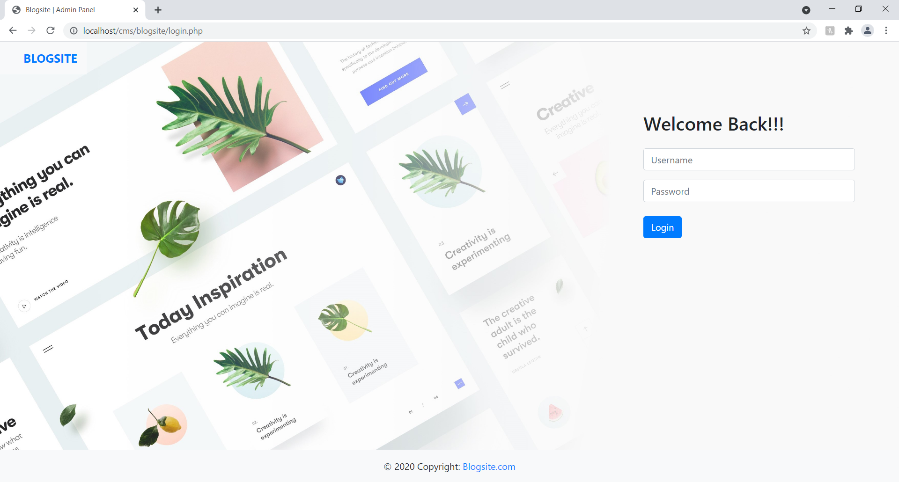
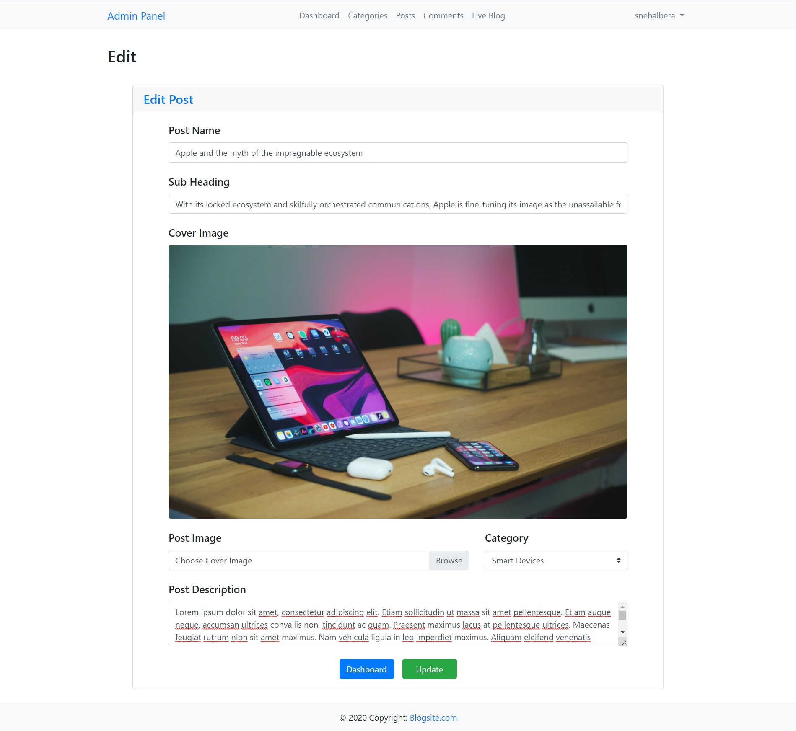

# Blogsite

A Content Management System for blogs, that can manage posts, admins, blog categories, admin-approved comments, and other features using Bootstrap, PHP and MySQL.

## Usage

* Download this repository
* Create a new database with a name **blogsite**
* Import **blogsite.sql** into the database
* For Admin controls, username: **admin** & password: **admin123** 
* Enjoy 😊✌
